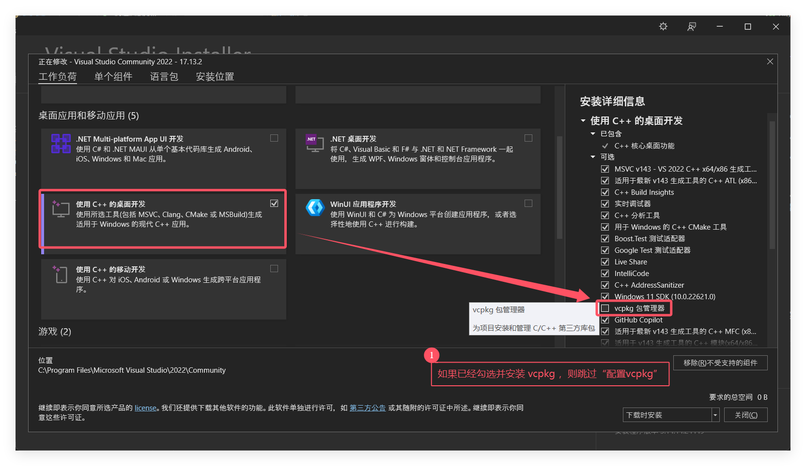

[<返回](../README_zh.md)

# 先决条件

- 具有“C++开发工作负载”和“CMake组件”的[Visual Studio](https://visualstudio.microsoft.com/zh-hans/downloads/)。
- [Git](https://git-scm.com/book/zh/v2/%E8%B5%B7%E6%AD%A5-%E5%AE%89%E8%A3%85-Git)（国内镜像：[清华镜像源](https://mirrors.tuna.tsinghua.edu.cn/github-release/git-for-windows/git/LatestRelease/)）。

---

# 一、配置生成环境

- ## 配置vcpkg

如果已经配置了vcpkg，可以跳过这一步。

1. 参照《[Get started with vcpkg](https://vcpkg.io/en/getting-started.html)》安装vcpkg。

2. 将`VCPKG_ROOT`环境变量设置为vcpkg的根目录（例如：D:\dev\vcpkg），**建议设置为用户级环境变量**。

参考文档：《[vcpkg 文档](https://learn.microsoft.com/zh-cn/vcpkg/)》、《[CMake 集成](https://learn.microsoft.com/zh-cn/vcpkg/users/buildsystems/cmake-integration)》、《[Windows10 设置环境变量](https://zhuanlan.zhihu.com/p/231668109)》、《[Linux 基础-查看和设置环境变量](https://zhuanlan.zhihu.com/p/557885534)》

# 二、生成并运行

1. 生成项目。

    在Visual Studio中按下`Ctrl+Shift+B`以生成项目。

2. 运行该应用程序。

---

# 如何管理依赖库的版本

参考文档：《[教程：安装特定版本的包](https://learn.microsoft.com/zh-cn/vcpkg/consume/lock-package-versions?tabs=inspect-powershell)》
