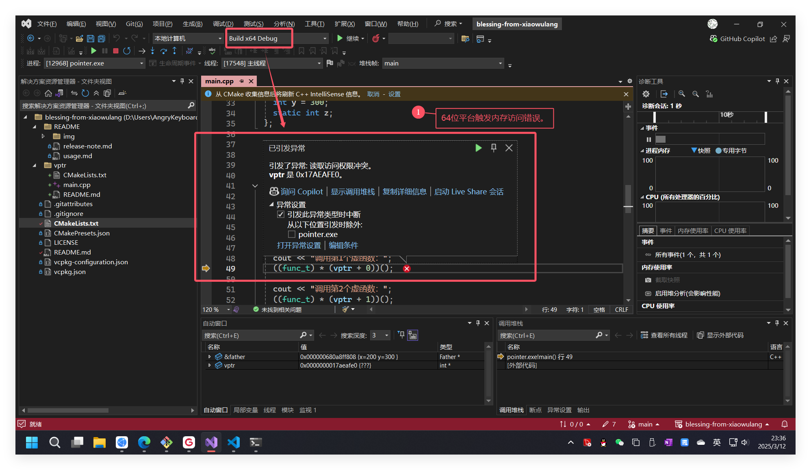
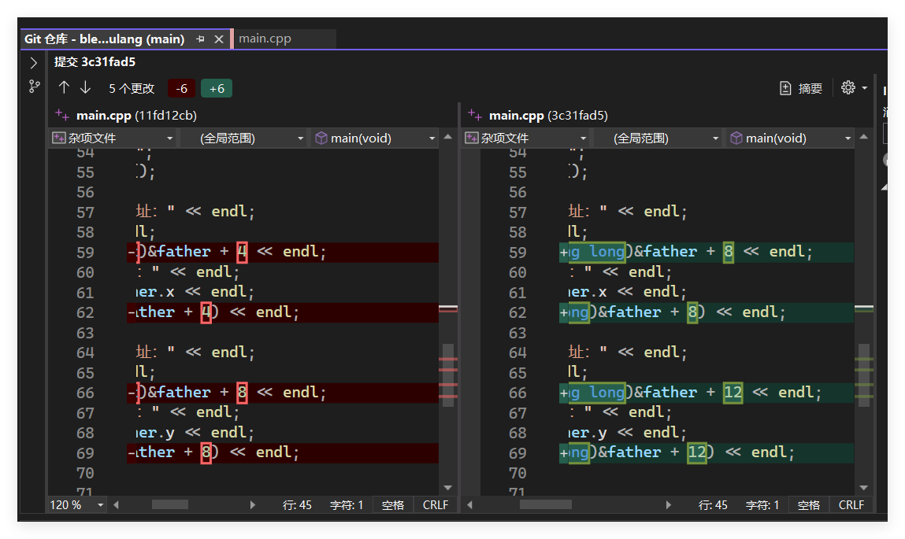
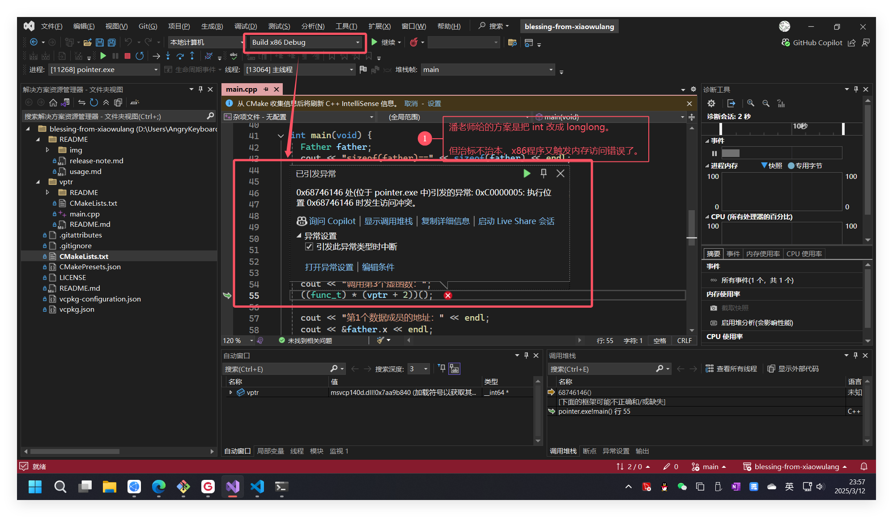

# 简介

## 课程源码

本程序目的是演示虚函数表指针的具体作用，但是课程源码包含一个严重的内存访问错误：

原因在于潘老师把虚函数表指针当成了`4字节`的`int`进行操作，而64位平台的指针是`8字节`。

## rock的解决方案

根据潘老师的解释，只需要把`int`换成`long long`就行了：

但实际上，只换`int`为`long long`是不够的，还需要手动改各种偏移量：

另外，改过的代码在`x86`程序中又出现了内存访问错误，所以是治标不治本的：

