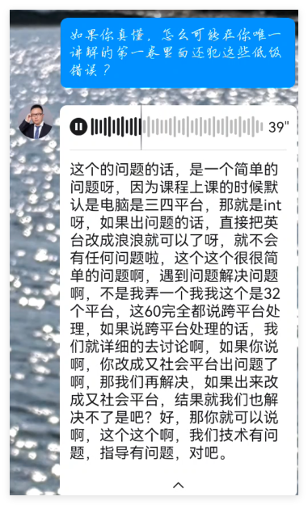

# 简介

## 课程源码

本程序目的是演示虚函数表指针的具体作用，但是课程源码包含一个严重的内存访问错误：


原因在于潘老师把虚函数表指针当成了`4字节`的`int`进行操作，而64位平台的指针是`8字节`。

## rock的解决方案

根据潘老师的解释，只需要把`int`换成`long long`就行了：



但实际上，只换`int`为`long long`是不够的，还需要手动改各种偏移量：


另外，改过的代码在`x86`程序中又出现了内存访问错误，所以是治标不治本的：


## 小五郎的解决方案

小五郎避免了指针和整数的混用，从根源上解决了问题：

| 平台 | 运行效果 |
|---|---|
| x64 |  |
| x86 |  |

## 分析

潘老师课程源码的错误根源在于：

```cpp
  int* vptr = (int*)*(int*)(&father);
```

这行代码在`x64`平台执行完`*(int*)(&father)`部分的时候，就已经将`vptr`的`64位地址`截断为`32位 int`，导致地址数据不完整，已经隐含BUG。

当程序执行到以下语句时，访问了错误内存：

```cpp
  ((func_t) * (vptr + 0))();
```

而潘老师随后的解决方案并没有更正`指针和整数`混用的根本错误，把代码强行改写成`x64`能运行的状态，到了`x86`平台时又因为`32位地址`与`64位 long long`宽度不匹配，造成地址数据被污染而发生内存访问错误。


# 总结

- 虚函数表指针是一个指向虚函数表的指针，虚函数表是一个指针数组，存放虚函数的地址。
- 指针和整数混用是一个很严重的错误，必须避免。
